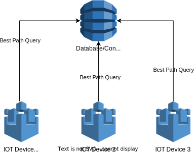

# Problem Overview 

The aim of the project is to develop a shortest path algorithm based on a graph $G=(V,E)$ where $V$ is the set of devices and $E$ is the set of edges connecting the devices. 

# Definitions:

- An outdegree of a node $v$ in a unidirected graph $G=(V,E)$ denotes the number of nodes whose input comes from $v$: 
$$ outdegree(v) = |\{(v,u): u \in V, (u,v) \in E\}| $$
- A cost function for an edge is univariate if there is only one value associate with that edge: 

$$c:E\rightarrow \mathbb{R} $$
- A cost function for an edge is multivariate if there are multiple aspects of costs associated with that edge: 

$$c: E \rightarrow \mathbb{R^n} $$

- A path in a unidirect graph is a set of vertices connected by valid edges: $p = v_1 \rightarrow v_2 \rightarrow v_3 \rightarrow v_k$ where $v_1,\dots,v_k \in V$ and $(v_i,v_j) \in E$. If there is only one path between $v_1$ and $v_k$, we can use the shorthand notation $p=(v_1 \rightarrow v_k)$ to denote such path.

- The cost or costs of a path $p$ can be determined recursively, as the sum of the costs of individual edges on the path: 

$$c(v_1\rightarrow v_k) = c(v_1,v_2) + c(v_2\rightarrow v_k)$$

- A utility function represent the modeller's ordinal preference over a set of costs. That is: 
$$f: Range(c) \rightarrow \mathbb{R} $$

- We say that a path $(u,v)$ is preferred over a path $(u,w)$ iff the utility value of $(u,v)$ is greater than that of $(u,w)$:

$$ (u\rightarrow v) > (u \rightarrow w) \iff f(c(u \rightarrow v)) > f(c(u \rightarrow w)) $$

# Assumptions: 

- The flow of goods is uni-directional. That is $G$ is unidirected. 
- Each device is network connected (WAN/LAN/the Internet).
- Each device can be remote controlled. A node with outdegree greater than 1 can direct the flow to a target node based on remote instruction.
- Regardless of whether the cost function is univariate or multivariate, there exists a known utility function that we can use to determine the preference between two paths. 

## System Design 

The initial design follows a Software Defined Networking approach, in which there is a separation between routing and forwarding functionalities. The database server acts as a remote controller in charge of determining the best routing path among devices, and the devices in the factory act similar to a router, simply forwarding the goods based on the best path set by the controller. This approach is preferred over the distributed routing architecture in this context because: 

- The central server/database generally has much more processing power and memory capacity than IOT devices. 
- This also allows for more complex routing algorthms should the needs arise. 
- Centralised routing algorithm generally has better convergence. 

## Database Design
Need more thoughts

